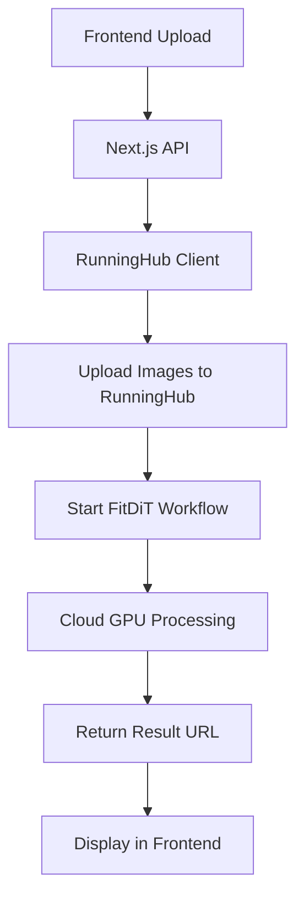

# RunningHub FitDiT Integration Setup

🚀 **Cloud-powered virtual try-on with professional GPUs!**

## ✅ What's Been Done

Your Next.js app has been updated to use **RunningHub's cloud ComfyUI** instead of local processing:

- ✅ **RunningHub API client** created (`src/utils/runninghub-client.ts`)
- ✅ **Virtual try-on endpoint** updated (`app/api/virtual-tryon/route.ts`)
- ✅ **Status checking endpoint** updated (`app/api/virtual-tryon/status/[requestId]/route.ts`)
- ✅ **Image uploads** handled via RunningHub storage
- ✅ **Error handling** for cloud service failures

## 🎯 Next Steps

### 1. **Upload Your FitDiT Workflow to RunningHub**

1. Go to [RunningHub.ai](https://www.runninghub.ai/) and sign in
2. Navigate to **Workspace** → **Upload Workflow**
3. Upload your `FitDiT Clothing Change Workflow_api.json` file
4. Copy the **Workflow ID** from the URL (e.g., `wf_abc123def456`)

### 2. **Update Environment Variables**

Create/update your `.env.local` file:

```bash
# RunningHub API Configuration
RUNNINGHUB_API_KEY=9b0c6a7c053a47f89746be4d4fe3ec1d
RUNNINGHUB_BASE_URL=https://api.runninghub.ai
RUNNINGHUB_WORKFLOW_ID=1950994663052353537

# Keep existing keys
OPENAI_API_KEY=your_openai_key_here
```

### 3. **Test the Integration**

```bash
npm run dev
```

Visit `http://localhost:3000/virtual-tryon` and test with example images.

## 🔧 How It Works



1. **Images uploaded** to RunningHub storage
2. **Workflow triggered** with your FitDiT model
3. **Processing happens** on professional GPUs (RTX 4090)
4. **Results delivered** via public URLs

## ⚡ Benefits

| Local ComfyUI | RunningHub Cloud |
|---------------|------------------|
| 16GB Mac limit | 24GB+ GPU memory |
| 10+ minute processing | 30-60 seconds |
| Memory crashes | Stable processing |
| Manual setup | Instant deployment |
| Free but limited | Pay-per-use scalable |

## 🐛 Troubleshooting

### **"Workflow ID not found"**
- Ensure you've uploaded your FitDiT workflow to RunningHub
- Copy the exact workflow ID from the RunningHub URL
- Update `RUNNINGHUB_WORKFLOW_ID` in `.env.local`

### **"API key invalid"**
- Verify your RunningHub API key is correct
- Check if you need to generate a new key in your RunningHub account

### **"Upload failed"**
- Ensure images are valid JPG/PNG format
- Check file sizes (RunningHub has upload limits)
- Verify your API key has upload permissions

## 💰 Pricing

RunningHub pricing is **pay-per-use**:
- **GPU time**: ~$0.50/hour for RTX 4090
- **Storage**: Minimal cost for image hosting
- **No monthly fees** - only pay when processing

**Typical cost per try-on**: $0.01-0.05

## 🔄 Fallback Options

If RunningHub is unavailable, you can easily switch back to:
1. **Local ComfyUI** (uncomment old imports)
2. **Replicate** (add Replicate integration)
3. **Other cloud providers** (extend the client)

---

🎉 **You're ready to scale!** No more Mac memory limits or crashes. 